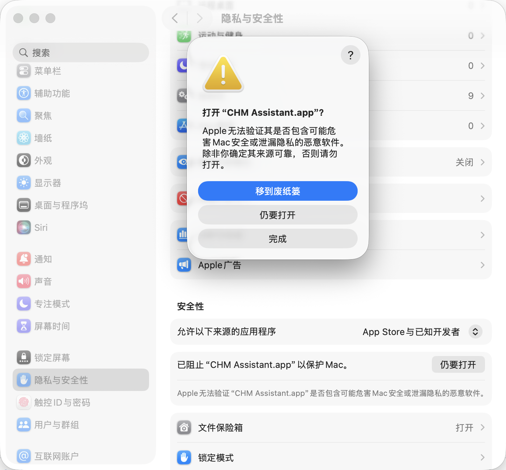

# macOS 安装说明

从 [GitHub Releases](https://github.com/tagecode/chm-assistant/releases) 下载 `.dmg` 或 `.zip`，将 **CHM Assistant** 拖入「应用程序」文件夹即可安装。

当前发布包**未进行 Apple 开发者签名**（见 [ci.md](./ci.md)）。首次打开时，macOS 会提示无法验证开发者并阻止运行，这是正常现象，按下列步骤允许即可。

## 允许打开应用

1. 双击 **CHM Assistant** 尝试启动（会被系统拦截）。
2. 打开 **系统设置** → **隐私与安全性** → 滚动到 **安全性** 区域。
3. 找到提示 **「已阻止 "CHM Assistant.app" 以保护 Mac」**，点击右侧 **仍要打开**。
4. 在弹出的确认对话框中再次点击 **仍要打开**（勿选「移到废纸篓」）。

完成上述操作后，应用即可正常启动；之后无需重复设置。

## 可选：右键首次打开

若尚未出现上述「仍要打开」按钮，可在 Finder 中 **按住 Control 键点击**（或右键）**CHM Assistant.app**，选择 **打开**，在对话框中确认 **打开**。部分 macOS 版本下，此方式可触发首次放行。

## 相关说明

- 仅阅读 CHM **不需要**额外安装编译器；创作与编译说明见 [compiler-setup.md](./compiler-setup.md)。
- 若仍无法启动，请确认下载的是与 Mac 芯片匹配的版本（Apple 芯片选 `arm64`，Intel Mac 选 `x64`）。
